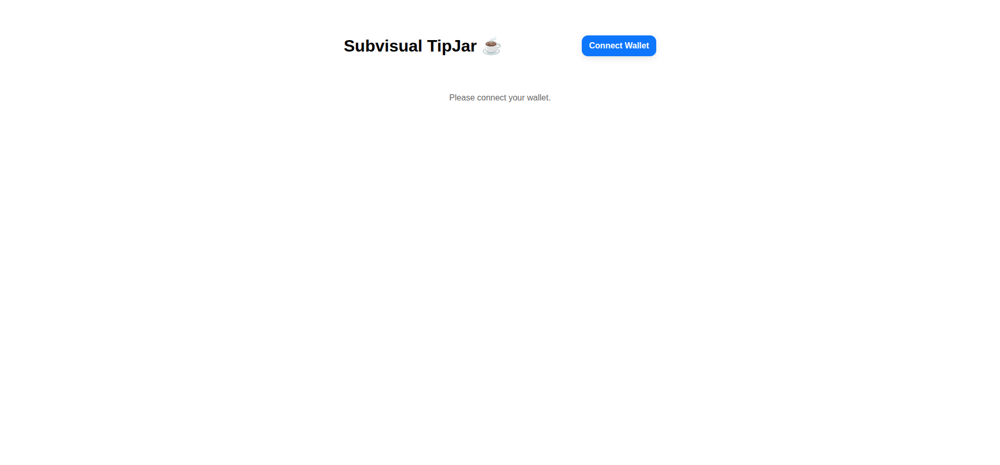
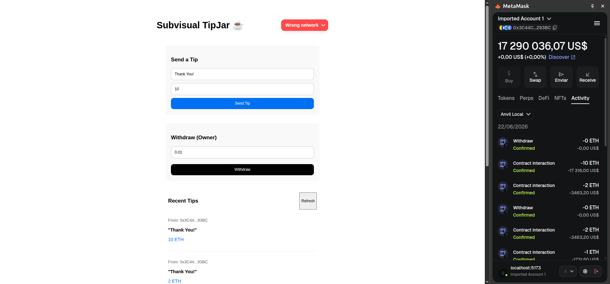

# ☕ Subvisual TipJar

A decentralized application (dApp) built as part of the Subvisual Apprenticeship Challenge.

It demonstrates wallet connection, smart contract interaction, and a full-stack Web3 workflow using:

- Solidity
- Foundry
- React + TypeScript
- Wagmi
- RainbowKit (Reown)
- Viem
- Anvil (local blockchain)

---

# 🧠 Project Overview

This project implements a simple TipJar dApp where:

- Users connect their wallet (MetaMask)
- Send ETH tips with messages
- Store tips on-chain in a smart contract
- The contract owner can withdraw funds
- Fully local blockchain environment using Anvil

---

# ✨ Features

- Wallet connection via MetaMask (RainbowKit / Reown)
- Send ETH tips with custom messages
- Read on-chain tips from smart contract
- Owner-only withdrawals
- Local blockchain (Anvil)
- Smart contract tests (Foundry)

---

# 🧱 Tech Stack

## Smart Contract
- Solidity
- Foundry

## Frontend
- React
- TypeScript
- Vite
- Wagmi
- RainbowKit (Reown)
- Viem

---

# ⚙️ Smart Contract Setup

## 1. Install dependencies

```bash
forge install
```

---

## 2. Start local blockchain (Anvil)

```bash
anvil
```

This starts a local Ethereum blockchain:

- RPC URL: http://127.0.0.1:8545
- Chain ID: 31337
- 10 accounts pre-funded with 10000 ETH each

---

## 3. Build contracts

```bash
forge build
```

---

## 4. Run tests

```bash
forge test
```

---

## 5. Deploy contract

### Step 1 - Create `.env`

Inside `/contracts`:

```
PRIVATE_KEY=0xYOUR_ANVIL_PRIVATE_KEY
```

Example:

```
0xac0974bec39a17e36ba4a6b6d4d238ff944bacb478cbed5efcae784d7bf4f2ff80
```

---

### Step 2 - Load environment variables

```bash
cd contracts
source .env
```

---

### Step 3 - Deploy contract

```bash
forge script script/TipJar.s.sol \
--rpc-url http://127.0.0.1:8545 \
--broadcast \
--private-key $PRIVATE_KEY
```

---

### Step 4 - Update frontend contract address

After deployment, you MUST copy the new contract address from the terminal:

```
TipJar deployed at: 0xNEW_DEPLOYED_ADDRESS
```

Then update the frontend constant in `frontend/src/constants.ts`:

```ts
export const TIP_JAR_ADDRESS = '0xNEW_DEPLOYED_ADDRESS'
```

---

# 🎨 Frontend Setup

## 1. Install dependencies

```bash
cd frontend
npm install
```

If needed:

```bash
npm install wagmi viem @rainbow-me/rainbowkit @tanstack/react-query
```

---

## 2. Run frontend

```bash
npm run dev
```

App runs at:

```
http://localhost:5173
```

---

# 🦊 Wallet Setup (MetaMask + Anvil)

## 1. Add Local Network

- Network Name: Localhost
- RPC URL: http://127.0.0.1:8545
- Chain ID: 31337
- Currency: ETH

---

## 2. Import Anvil Account

MetaMask:

Accounts → Add Wallet → Import account

Paste one of the private keys generated by Anvil:

```bash
Private Keys
==================

(0) 0x...
(1) 0x...
```

---

# 🌐 Reown (RainbowKit)

This project uses RainbowKit (powered by Reown) to:

- Connect wallets
- Handle network switching
- Detect wrong network state
- Provide wallet UI abstraction

---

# ⚠️ Network Notice

You may see "Wrong Network".

This is expected because:
- The app runs on a local Anvil chain
- Chain ID is 31337
- MetaMask also includes Sepolia/Mainnet

As long as "Localhost" is selected, everything works correctly.

---

# 📸 Screenshots

### Home (wallet disconnected)


### Main application (tips + withdraw)


---

# ⚠️ Important

This project is for local development and learning purposes only.

Do not use Anvil private keys in production.
